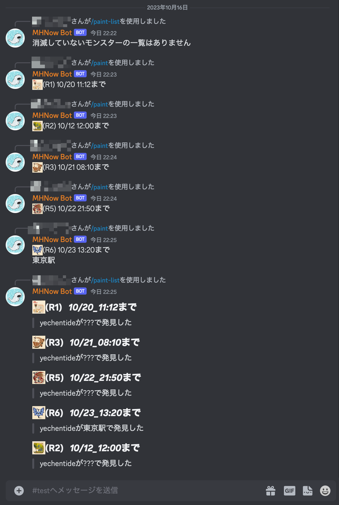
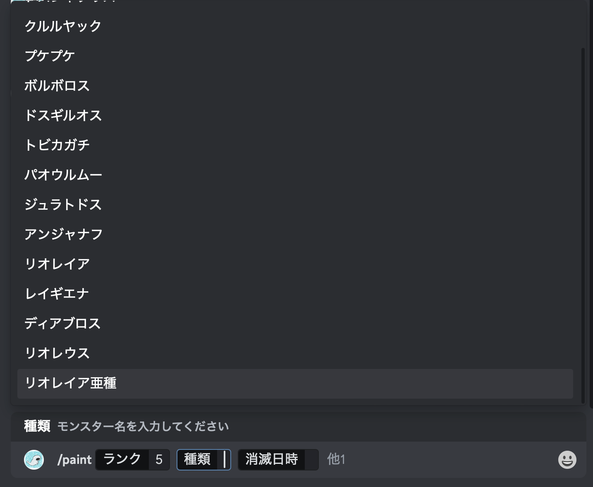

# MHNow-Bot

## 機能一覧

- コマンド`/paint`: マーキングしたモンスターを登録する
- コマンド`/paint-list`: マーキングしたモンスターの一覧をみる

## 使い方

1. [Discord Developer](https://discord.com/developers/applications)にアクセスしてDiscord Application(Bot)を作成する
2. Botのトークンをコピーしておく
3. データベースの１つであるPostgreSQLを使用するので、自分の環境に用意してください。Dockerが使えるなら、`docker`ディレクトリにあるcomposeファイルを使っても問題ない
4. [Releases](https://github.com/yechentide/mhnow-bot/releases)から実行ファイルをダウンロードする
5. その実行ファイルと同じディレクトリに、`.mhnow.toml`設定ファイルを置く
6. 設定ファイル内の`bot_token`を必ず自分のトークンに変える
7. 実行ファイルを起動する

## イメージ

